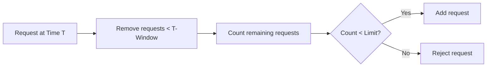

# Rate Limiter Design Pattern - Sliding Window Implementation

## Overview
This project implements a **distributed rate limiter** using the **Sliding Window algorithm** with Redis and Spring Boot. It provides precise request limiting that prevents the "burst at window edges" problem of fixed window approaches.

## Key Features
- 🚦 **Sliding Window Algorithm** - More accurate than fixed window counting
- ⚡ **Redis-backed** - Works in distributed environments
- 🔧 **Configurable** - Adjust limits per endpoint/client
- 📊 **Efficient** - O(1) complexity for most operations
- ⏱️ **Time-aware** - Precise request tracking in real-time windows

## How It Works

### Sliding Window Algorithm


1. For each request at time `T`:
   - Remove all requests older than `T - WindowSize`
   - Count remaining requests in the window
   - Allow request if count < limit
   - Add current request to the window

### Redis Data Structure
- **Key**: `rate_limit:<client_id>`
- **Type**: Sorted Set (ZSET)
  - **Members**: Unique request IDs (UUID)
  - **Scores**: Timestamps in seconds

## Getting Started

### Prerequisites
- Java 17+
- Redis 6+
- Spring Boot 2.7+

### Installation
1. Clone the repository:
   ```bash
   git clone repo-name
   ```
2. Configure Redis in `application.properties`:
   ```properties
   spring.redis.host=localhost
   spring.redis.port=6379
   ```

### Usage
Annotate endpoints with `@RateLimit`:
```java
@RateLimit(key = "login_api", limit = 5, windowInSeconds = 30)
@PostMapping("/login")
public ResponseEntity<String> login() {
    return ResponseEntity.ok("Login successful");
}
```

## API Endpoints
| Endpoint | Method | Description |
|----------|--------|-------------|
| `/api/limited` | GET | Rate-limited endpoint (5 requests/30 sec) |
| `/api/unlimited` | GET | Non-limited endpoint |

## Configuration Options
Customize in the `@RateLimit` annotation:
```java
@RateLimit(
    key = "custom_key",      // Rate limit group identifier
    limit = 100,            // Max requests per window 
    windowInSeconds = 60    // Time window duration
)
```

## Performance Considerations
- **Redis Pipelining**: Reduces round-trips for batch operations
- **Local Caching**: Cache allowed requests to minimize Redis calls
- **Lua Scripting**: Ensures atomic operations in Redis

## Monitoring
Track rate-limited requests with:
```bash
# Redis CLI commands
ZRANGE "rate_limit:client123" 0 -1 WITHSCORES  # View requests
TTL "rate_limit:client123"                     # Check expiration
```
